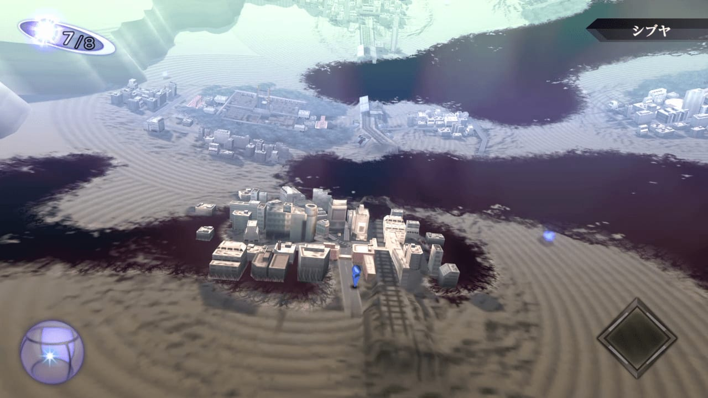
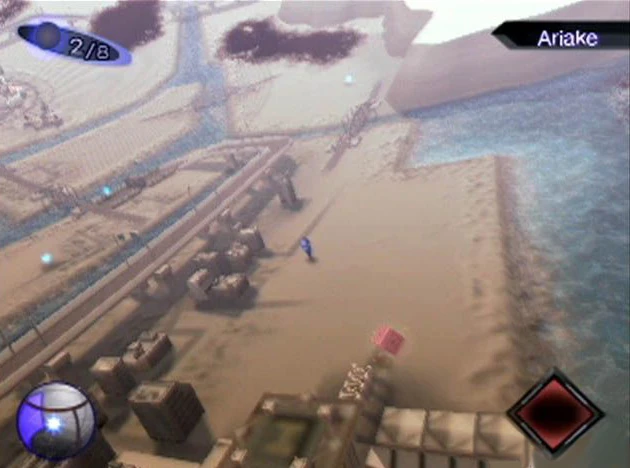
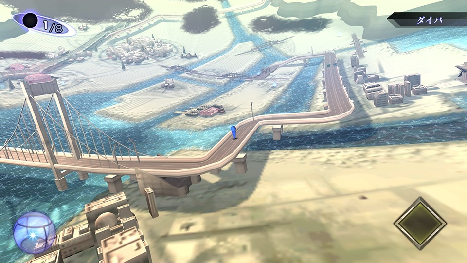
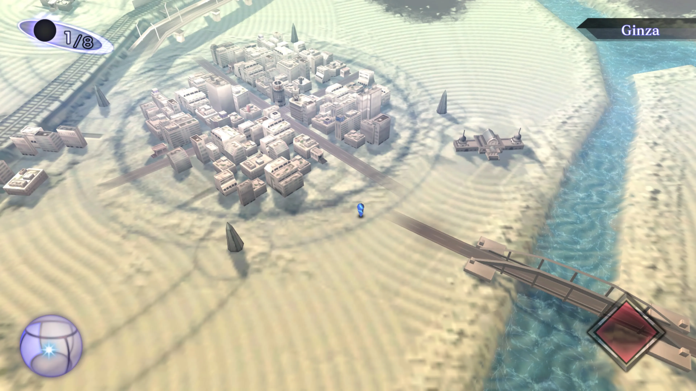
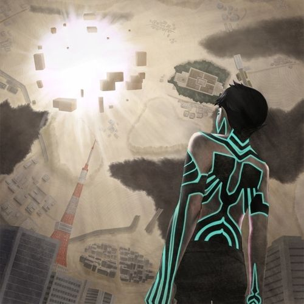
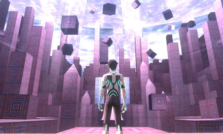

# Visual Direction — Sixth Borough

**Locked thesis (one sentence)**: PS2 aesthetic is a constraint language for *memory*, not a 3D world the user walks through. The map stays a flat social interface. PS2 only kicks in *inside* the ghost encounter.

**Two modes, two grammars**:
1. **Overworld (Map = Lobby)** — top-down isometric, washed cool palette, hazy distance, tiny cursor exploring monumental emptiness. This is where 95% of the user time is spent.
2. **Encounter (Ghost = Dungeon)** — character-scale dive, saturated accent against muted base, surreal architectural scale, fixed camera framing. This is the 30-60 second moment when a user clicks a ghost.

The two modes never blur. The map is the lobby. The ghost is the dungeon. Don't merge them.

---

## MODE A — OVERWORLD (the social map)

**Reference: SMT3 Nocturne Vortex World**. The Demi-fiend wanders a ruined Tokyo where each district sits as an isolated diorama in a hazy void. This is *exactly* the visual grammar Sixth Borough needs for its NYC borough map: each neighborhood is a discrete tile in a fog-occluded field of memory.

### Reference 01 — Shibuya from above

What to extract:
- **Top-down quasi-isometric camera angle** (~45° pitch). Never first-person, never free-camera. The user looks *down on the city* like a god looking at a model train set.
- **District as diorama on a plate**: a single neighborhood floats inside a circular crater of dark void. Sixth Borough should render each NYC neighborhood the same way — Bronx as a tile, Williamsburg as a tile, Lower East Side as a tile.
- **Pale grey-white buildings** with almost no surface detail. Silhouette and footprint matter more than texture.
- **Tiny figure (Demi-fiend) inside the cluster** — barely visible, scale-dwarfed by the architecture. In Sixth Borough, the user's cursor or "ghost" indicator should feel just as small.
- **HUD chips in corners only**: top-left compass, top-right neighborhood label ("シブヤ" / "BRONX"), bottom corners for state. Center stays empty for the world.

### Reference 02 — Ariake monumental emptiness

What to extract:
- **Scattered concrete debris in foreground**, monumental but anonymous. In Sixth Borough this maps to demolished-building footprints — the *absence* of a building is a visual element, not a hole.
- **Brown-grey-pale palette in the foreground**, transitioning to icy blue at the horizon. Use this color graduation to signal *temporal distance* — recent memory in warm sand tones, distant memory in cold haze.
- **Heavy atmospheric haze dissolving distant buildings into the sky**. Distance = forgetting. The further you look, the less you can see.

### Reference 03 — Daiba bridge infrastructure

What to extract:
- **Iconic infrastructure renders cleanly even at low poly**: a suspension bridge is recognizable from cable geometry alone. Sixth Borough's NYC bridges (Brooklyn Bridge, Manhattan Bridge, Queensboro, GWB) should be rendered the same way — recognizable silhouettes, no surface texture.
- **Water as a flat pale-blue plane** with minimal animation. No reflections, no specular. The water is a *symbol of water*, not a physical simulation.
- **Roads as thin dark lines threading the world**. They guide the eye between districts.

### Reference 04 — Ginza with vortex rings

What to extract (this is the single best overworld reference for our use case):
- **Concentric circular ground patterns radiating from a focal point**. In SMT3 these are the Magatsuhi vortices. In Sixth Borough these become **memory anchors** — concentric rings on the ground around a ghost spawn point indicate "something happened here."
- **Conical pylons / spikes** scattered around the rings as markers. We can use these as ghost-spawn indicators — small, low-poly, immediately recognizable as "interactive."
- **The Demi-fiend (small blue figure) on a road, walking toward a marker**. The user's interaction loop in Sixth Borough is the same: see a marker, walk toward it, dive in.
- **Saturated turquoise water against beige ground** — the ONE place in the overworld palette where saturation is allowed. Use sparingly: rivers, harbor, one accent color per district.

### Mode A keyword chips (give these to Marvens too)

- `top-down isometric camera, ~45° pitch, fixed`
- `vertex lighting, no per-pixel shading`
- `volumetric fog with cool falloff at distance`
- `pale washed palette: grey-white-beige-blue, never saturated except one accent`
- `low-poly buildings, ~500-2000 polys per structure`
- `256×256 textures, 16-color palette per texture`
- `affine texture warping (the PS2 wobble — emulate via UV jitter shader)`
- `tiny figure dwarfed by architecture`
- `HUD chips in corners only, center always empty`
- `district-as-diorama: each neighborhood is an island, void between`
- `memory anchors: concentric rings + low-poly pylons mark ghost spawn points`

### Mode A — DO NOT

- Do **not** use a free-camera or first-person mode. The map is god-view, always.
- Do **not** add detailed textures, normal maps, or PBR. The constraint is the message.
- Do **not** make districts contiguous like a real-world map. The void *between* districts is part of the aesthetic — it represents the parts of the city that aren't yet remembered.
- Do **not** use a saturated UI. HUD chips stay desaturated. ONE accent color per district, max.
- Do **not** animate the water or sky. Stillness is part of the haunting.

---

## MODE B — ENCOUNTER (the ghost dive)

**Reference: SMT3 Nocturne keyart + Labyrinth of Amala**. When the Demi-fiend descends into a memory layer, the camera locks on him at character scale and the world becomes surreal — floating monoliths, saturated dimensions, monumental architectural impossibilities. This is what should happen for ~30-60 seconds when a Sixth Borough user clicks a ghost on the map.

### Reference 05 — Demi-fiend keyart (the encounter mood)

What to extract:
- **Character framed from behind**, looking up at an unworldly intrusion. In Sixth Borough this maps to the user's POV "becoming" the ghost they clicked, looking up at the memory unfolding.
- **Saturated teal accent (the body markings) against a muted brown-sepia base**. The whole world is desaturated EXCEPT the thing the user came here to see.
- **Iconic real-world landmark anchoring the scene** (Tokyo Tower in lower-left, still standing after the apocalypse). Sixth Borough should always anchor the encounter to a *real* NYC landmark visible in the frame — Empire State, Brooklyn Bridge, Yankee Stadium, Apollo Theater. Memory needs a place.
- **Floating geometric debris (cubes) orbiting a bright sun**. Visualizes "the past intruding on the present" — perfect for a cultural memory dive.
- **Painted/illustrated style rather than in-game**. Use this as the *transition card* between map and encounter — a 1-second illustrated overlay that bridges the two modes.

### Reference 06 — Labyrinth of Amala (the encounter dimension)

What to extract:
- **Massive floating geometric monoliths** in a vast empty space. Character is *small*, architecture is *enormous*. Sixth Borough's encounter dimension should follow the same scale ratio — the user's POV-ghost is tiny, the memory is towering.
- **Strong purple-magenta-violet palette** (the ONE place we go saturated). The encounter dimension is allowed to be vivid because it's a discrete moment, not the whole map.
- **Vertex lighting clearly visible on the character body** — facets, hard shading boundaries, no smooth shading. Marvens's low-poly Blender ghost meshes should ship with vertex normals only.
- **Floating cubes filling the upper sky** as a passive ambient element. In Sixth Borough this becomes the *photo layer* — when a user dives into a ghost, the 750 NYPL Milstein archival photos can float above as ambient cubes drifting in the sky, each one a fragment of the memory layer.

### Mode B keyword chips

- `character-scale fixed camera, third-person locked behind/above`
- `30-60 second encounter duration, then return to overworld`
- `vertex lighting on hero, no per-pixel`
- `desaturated base + ONE saturated accent (encounter color, varies by ghost niche)`
- `monumental scale ratio: hero is small, architecture is towering`
- `iconic NYC landmark always visible in the frame`
- `floating geometric debris drifting passively in upper sky (use NYPL photos as cubes)`
- `painted/illustrated transition card on entry (1 second), in-game on exit (snap)`

### Mode B — DO NOT

- Do **not** make encounters interactive in a game sense. No combat, no choices. The user *witnesses* the memory; they don't fight in it.
- Do **not** let an encounter run longer than 60 seconds without an exit affordance. The user must always feel they can return to the map.
- Do **not** use the same accent color for every encounter — vary by niche (hip-hop = neon green, immigration = warm amber, demolished theaters = ghost blue, jazz = brass yellow).
- Do **not** transition with a hard cut. Use the painted illustration card as a 1-second bridge so the mode switch feels intentional, not jarring.

---

## SMT3 → Sixth Borough translation table

| SMT3 element | Sixth Borough equivalent |
|---|---|
| Vortex World districts as isolated dioramas | NYC neighborhoods as discrete tiles in a fog field |
| Demi-fiend wandering | User cursor / "ghost POV" exploring the map |
| Magatsuhi pylons + concentric rings | Memory anchors marking ghost spawn points |
| Volumetric fog + atmospheric haze | Memory occlusion — distance equals forgetting |
| Tokyo Tower as iconic anchor in keyart | Empire State / Brooklyn Bridge / Apollo Theater anchoring each encounter |
| Labyrinth of Amala dimension | Ghost encounter dimension on click |
| Floating cubes in upper sky | NYPL Milstein archival photos as ambient drifting layer |
| Press Turn battles | (deliberately not translated — Sixth Borough is not a game) |

---

## Technical asks (for Marvens and Carson)

For Marvens (Blender ghost meshes):
- Polygon budget: 500-2000 per ghost
- Vertex normals only (no smoothing groups)
- Single 256×256 diffuse texture per ghost, 16-color palette
- Export: glb (per the locked format contract)
- Naming: `{niche}_{slug}_ghost.glb` so the manifest can pick them up

For Carson (Bevy renderer):
- Add a UV-jitter shader to emulate PS2 affine texture warping (~10 lines)
- Volumetric fog with cool blue-grey falloff, density tuned so distant districts dissolve at ~2 city-block distance
- Disable per-pixel lighting on the `Ghost` component, force vertex lighting
- Camera: fixed isometric over the map, free orbit only inside an active encounter
- HUD: corner chips only, never center

---

## How to defend this in the pitch

If a judge asks "why PS2 and not photoreal," the answer is one sentence:

> *"Photoreal flattens. Memory isn't photoreal. Memory is low-fi, fog-occluded, lit weird, and spatially anchored to a place. PS2 is the only aesthetic that visually matches how memory actually works in the body."*

If a judge asks "isn't this just nostalgia," the answer is one sentence:

> *"Nostalgia is the surface. The deeper reason is that low-poly is a constraint language: it forces clarity, privileges silhouette, and makes ghosts feel ghostly because vertex lighting on facets reads as spectral. We're not retro — we're using a grammar that happens to share its hardware era with the PS2."*

---

## What's NOT in this doc (deliberately)

- No mood-board for the underlying NYC base map data (that's MapPLUTO + TUM LoD2 territory, see DECISIONS.md borough expansion section)
- No spec for the 750 NYPL photo layer (that's `cultural-content/oldnyc/index.json`, see James's `bde0148`)
- No narration / voice / audio direction (separate doc)
- No interaction grammar beyond click-to-dive / corner-to-return (deliberate — keep it minimal)

The single load-bearing decision in this doc: **two modes, two grammars, never blurred.** Everything else flows from that.
